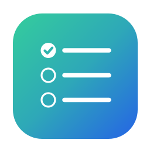
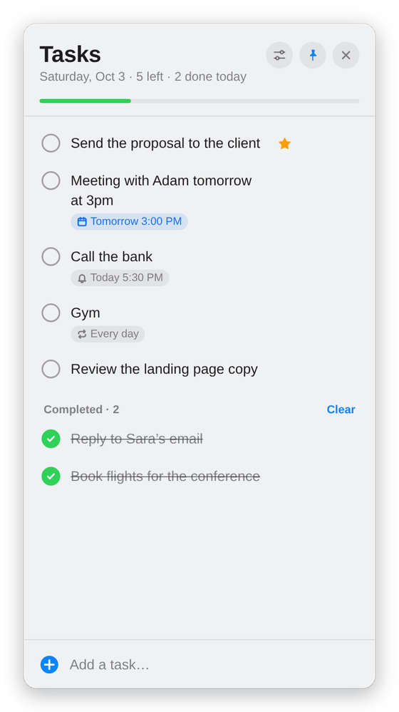
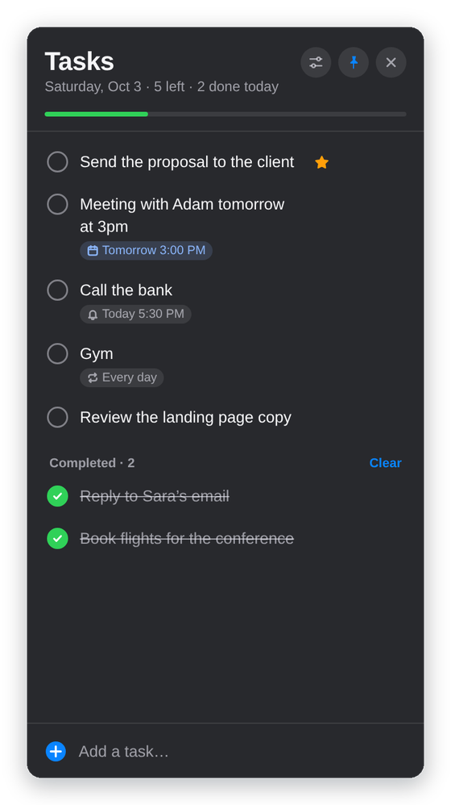
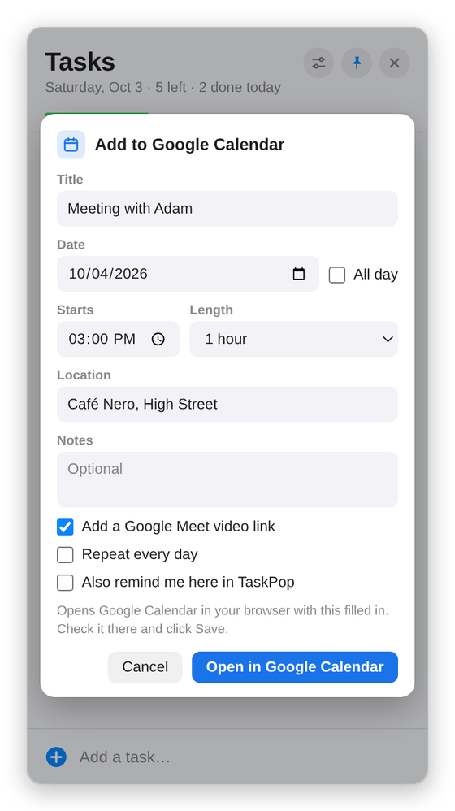
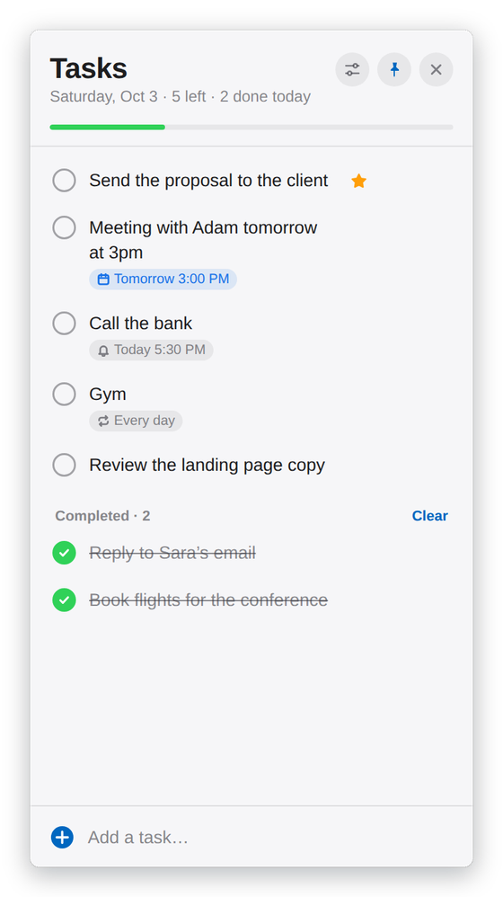
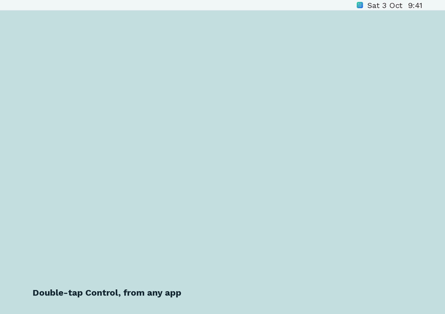
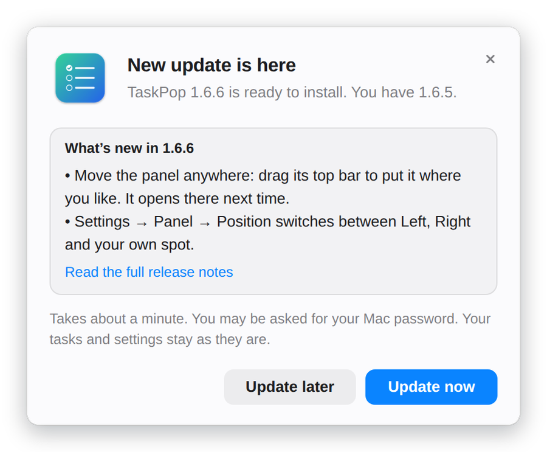
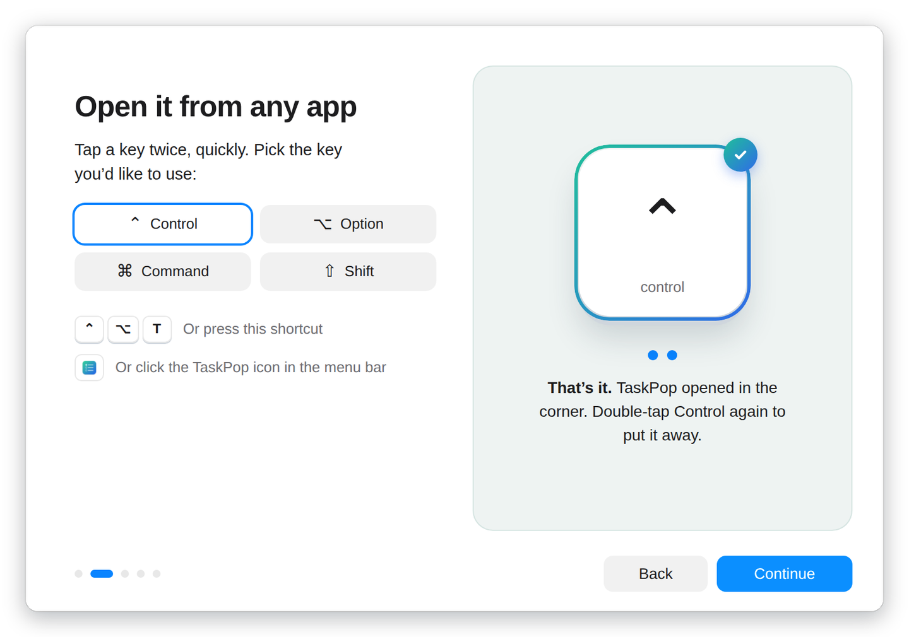

<p align="center">
  
</p>

<h1 align="center">TaskPop</h1>

<p align="center">
  A small to-do list that slides in from the corner of your screen.<br>
  Double-tap a key from any app and your tasks are there. Free, open source, and your tasks stay on your computer.
</p>

<p align="center">
  <a href="https://taskpop.asmlab.agency">Website</a> ·
  <a href="#install">Install</a> ·
  <a href="#everything-it-does">Features</a> ·
  <a href="#private-by-default">Privacy</a> ·
  <a href="CHANGELOG.md">Changelog</a> ·
  <a href="SUPPORT.md">Support</a>
</p>

<p align="center">
  <a href="https://github.com/asmrayat/Task-pop/releases/latest"></a>
  <a href="https://github.com/asmrayat/Task-pop/releases"></a>
  <a href="https://github.com/asmrayat/Task-pop/actions/workflows/ci.yml"></a>
  <a href="#what-you-need"></a>
  <a href="#what-you-need"></a>
  <a href="LICENSE"></a>
</p>

<p align="center">
  <a href="https://taskpop.asmlab.agency/#download"><strong>Download for Mac</strong></a> &nbsp;·&nbsp;
  <a href="https://taskpop.asmlab.agency/#download"><strong>Download for Windows</strong></a>
</p>

<p align="center">
  
  
  
  
</p>

TaskPop is the list you don't have to remember to open. It lives in the menu bar on a Mac and next to the clock on Windows, slides in when you open your laptop, and comes and goes with a double-tap of Control (or a key you pick). Tick things off, set a reminder, send a task to Google Calendar, and get back to work. No account, no cloud, no tracking.

<p align="center">
  
</p>

## Everything it does

### Open it from anywhere

- **Double-tap a key.** Control, Option, Command or Shift on a Mac; Ctrl, Alt or Shift on Windows. Only a quick tap on its own counts, so shortcuts like ⌘C or Ctrl+C never open it, and typing capital letters with Shift doesn't either.
- **Keyboard shortcut.** ⌃⌥T on a Mac, Ctrl+Alt+T on Windows, or one you record yourself.
- **Menu bar and tray icon.** Click it to open the list; right-click for Settings and more.
- **There when you start.** It pops up by itself when you open the lid, wake the computer or unlock the screen. Each one can be turned off.
- **Put it anywhere.** Drag the panel by its top bar and it opens in that spot next time, on the screen you left it on. It lines up with nearby edges and always stays fully on screen. Or keep it in the left or right corner.
- **Over full-screen apps too**, on every desktop (Space) on a Mac.

### Your list

- **Add in a second.** Type and press Return. Start a task with **!** to star it: starred tasks stay at the top.
- **Reminders.** Right-click a task or click **⋯** to be reminded in an hour, this evening, tomorrow morning or at any time. Mark it done or snooze it straight from the notification.
- **Daily routines.** Tasks set to repeat every day un-tick themselves each morning, reminder included.
- **Morning summary.** One notification at the time you choose, listing what's left.
- **Reorder** by dragging, or with ⌥↑ / ⌥↓ (Alt+↑ / Alt+↓). The blue line shows exactly where a task will land.
- **Keyboard first.** Arrows to move, Space to tick, Return to edit, Delete to remove, ⌘Z / Ctrl+Z to undo, N to start a new task, G to send the selected task to Google Calendar.
- **Tidy by itself.** Delete completed tasks automatically after a day or a week, or clear them with one click.

### Google Calendar, without connecting anything

Click **⋯** on a task and choose **Add to Google Calendar**. TaskPop reads dates like "tomorrow at 3pm" or "Fri 10:30" from the task, lets you set the time, length, location, notes, a daily repeat and a Google Meet link, then opens Google Calendar in your browser with the event filled in, ready to save. TaskPop never signs in to your Google account; if your browser has several, you can pick which one opens.

### Updates that ask first

When a new version is out, TaskPop asks with a small pop-up: **Update now**, or **Update later** and it asks again in a few hours. Updating downloads the new installer from this repository's releases, checks it against the SHA-256 checksum GitHub publishes for it, installs it and reopens, with your tasks and settings kept. On a Mac you type your password once; on Windows it needs nothing at all.

<p align="center">
  
</p>

### A guided start

The first time it runs, a one-minute tour shows how to open TaskPop. You pick your double-tap key and try it on a big on-screen key that presses down with yours. If macOS needs your permission first, the tour says so and opens the right page in System Settings. You can take it again any time from Settings.

<p align="center">
  
</p>

### Made to fit in

- Light and dark, following your system or set by hand. Translucent on a Mac, solid on Windows, each with the platform's own look.
- Choose the panel's width, whether it hides when you click elsewhere (or pin it open), and a soft sound when you tick something off.
- Your tasks are saved the moment you change them, with a backup of the previous save. Export them to a file and import them on another computer.

## Install

### Mac

1. Download **TaskPop-*version*.dmg** from the [latest release](https://github.com/asmrayat/Task-pop/releases/latest) or the [website](https://taskpop.asmlab.agency/#download). One file works on Apple silicon and Intel.
2. Open it and double-click **Install TaskPop**. Stay online: a first install downloads the rest of TaskPop (about 130 MB). Updates usually need no download.
3. TaskPop isn't notarized by Apple yet, so the first time macOS says it can't check the installer. Open **System Settings → Privacy & Security**, scroll down, click **Open Anyway** and confirm. You only do this once.
4. TaskPop appears in the menu bar and the welcome tour starts.

### Windows

1. Download **TaskPop-Setup-*version*.exe** from the [latest release](https://github.com/asmrayat/Task-pop/releases/latest) or the [website](https://taskpop.asmlab.agency/#download). One file works on x64 and ARM64 PCs.
2. Run it. It installs just for you, with no administrator prompt.
3. Until TaskPop is in the Microsoft Store, Windows may show a SmartScreen warning. Choose **More info**, then **Run anyway**.

## Uninstall

**Mac:** click the TaskPop icon in the menu bar, turn off **Open at Login** and choose **Quit**. Drag TaskPop from Applications to the Trash. Your tasks are in `~/Library/Application Support/TaskPop`; delete that folder too if you want them gone.

**Windows:** open **Settings → Apps → Installed apps**, find TaskPop and choose **Uninstall**. It asks whether to delete your tasks and settings as well.

## Private by default

Your tasks and settings live only on your computer. TaskPop has no account, no analytics, no ads and no tracking. It goes online only for things you can see: checking this repository for a new version (which you can turn off), downloading an update you chose to install, the installer fetching the rest of the app, and opening Google Calendar in your browser when you ask it to. The full story is in the [privacy notes](docs/PRIVACY.md).

The double-tap reads only whether Control, Option, Command or Shift is held down, plus a count of key presses so that shortcuts don't count as taps. It never records what you type. On a Mac that's the one permission TaskPop asks for; the [permissions guide](docs/PERMISSIONS.md) explains each one.

## What you need

- **Mac:** macOS 13 Ventura or newer, Apple silicon or Intel
- **Windows:** Windows 10 or 11, 64-bit (x64 or ARM64)

## Build it yourself

TaskPop is an [Electron](https://www.electronjs.org) app, plain JavaScript with no framework and no build step. You need [Node.js](https://nodejs.org) 22.12 or newer.

```sh
git clone https://github.com/asmrayat/Task-pop.git
cd Task-pop/app
npm install
npm start
```

The installers are built on Linux, and the tests run the real app made to act as macOS and as Windows:

```sh
tools/fetch-build-deps.sh          # once: pinned, checksum-verified build tools
python3 installers/mac/build.py    # → installers/mac/out/TaskPop-<version>.dmg
installers/windows/build-win.sh    # → installers/windows/out/TaskPop-Setup-<version>.exe
tests/run.sh                       # unit and app tests
```

[Building TaskPop](docs/BUILDING.md) covers the layout, the installers, the Microsoft Store package, the tests and how to publish a release.

## When something misbehaves

See [troubleshooting](docs/TROUBLESHOOTING.md) for the double-tap, notifications, installing and updating, or [support](SUPPORT.md) for how to get help.

## Documentation

- [Privacy](docs/PRIVACY.md): what does and doesn't leave your computer
- [Permissions](docs/PERMISSIONS.md): every permission, in plain words
- [Troubleshooting](docs/TROUBLESHOOTING.md): the common fixes
- [Building TaskPop](docs/BUILDING.md): code layout, installers, tests and releases
- [Contributing](CONTRIBUTING.md): how to help
- [Support](SUPPORT.md): where to get help
- [Security](SECURITY.md): how to report a vulnerability
- [Changelog](CHANGELOG.md): what changed in each version

## Community

Bug reports, ideas and pull requests are all welcome; the [contributing guide](CONTRIBUTING.md) shows where to start. If TaskPop earns its place on your screen, a ⭐ helps other people find it.

## License

[MIT](LICENSE), copyright 2026 asmlab. The license covers the source code; the TaskPop name and icon are covered separately in [TRADEMARKS.md](TRADEMARKS.md).

<p align="center">
  <sub>Made by <a href="https://asmlab.agency">asmlab</a></sub>
</p>
